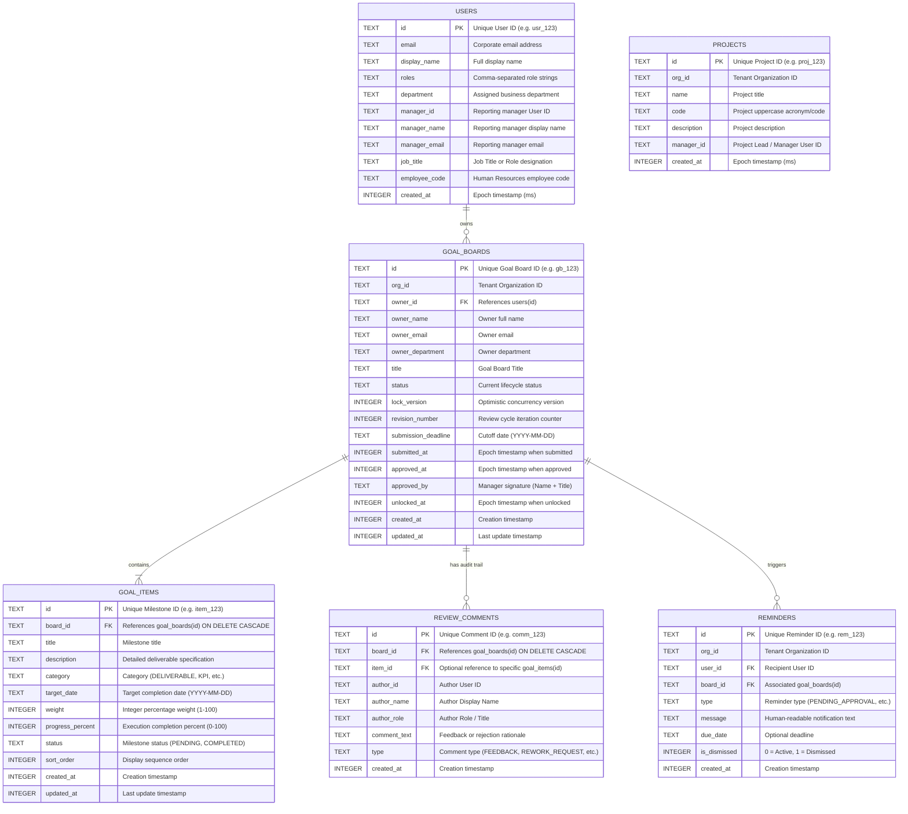
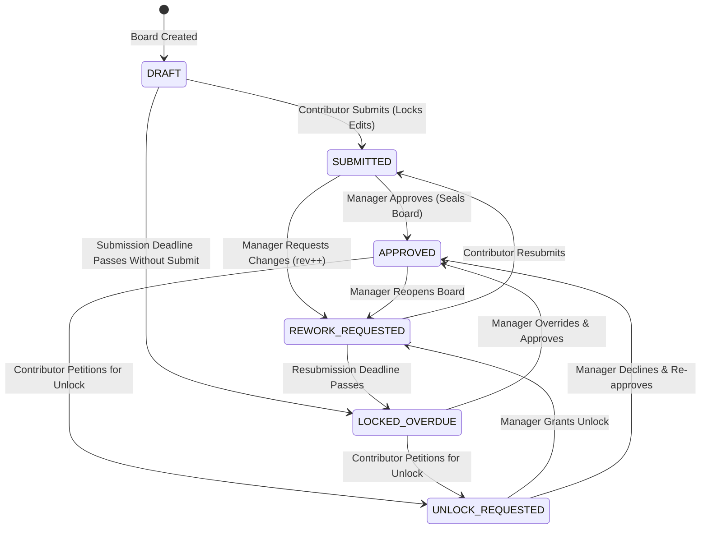

# Data Models & State Machine Architecture

> **Document Type**: Technical Architecture Specification | **Standard**: SG Forge Clean Architecture (2026 LTS) | **Traceability**: `[HLR-GOALS-001]`, `[HLR-GOALS-002]`, `[LLR-GOALS-002]`, `[LLR-GOALS-004]`

---

## 1. Entity-Relationship Data Model

The Individual Goal Center persists all relational state inside a dedicated Turso SQLite database file (`data/goals.db`), operating in Write-Ahead Logging (WAL) mode.



---

## 2. Finite State Machine Lifecycle Transitions

The review lifecycle is managed as a strict finite state machine:



---

## 3. Database Indexes & Query Optimizations

To guarantee low latency (<5ms) across concurrent operations:
```sql
CREATE INDEX IF NOT EXISTS idx_goal_boards_org_owner ON goal_boards(org_id, owner_id);
CREATE INDEX IF NOT EXISTS idx_goal_items_board_id ON goal_items(board_id);
CREATE INDEX IF NOT EXISTS idx_review_comments_board_id ON review_comments(board_id);
CREATE INDEX IF NOT EXISTS idx_reminders_org_user ON reminders(org_id, user_id, is_dismissed);
```

---

## 4. Integrity Constraints & Mathematical Invariants

1. **100% Weight Sum Invariant**:
   $$\sum_{i=1}^{N} \text{item.weight}_i = 100$$
   Enforced server-side during `updateGoalItems`. An attempt to submit items summing to $\neq 100$ aborts the transaction with `ValidationError`.
2. **Referential Cascade Invariant**:
   Foreign keys enforce `ON DELETE CASCADE` on `goal_items`, `review_comments`, and `reminders`. Deleting a parent `goal_boards` record cleans up all dependent child entities atomically.
3. **Optimistic Locking Invariant**:
   Any update to `goal_boards` increments `lock_version = lock_version + 1`. If two concurrent updates target the same record, version collision prevents overwriting.
