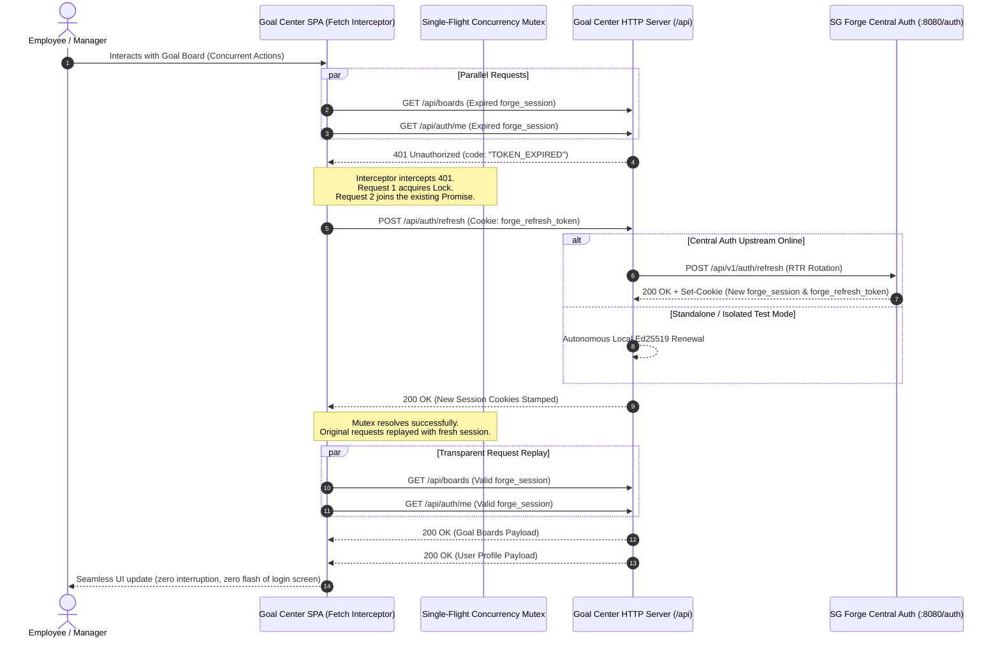
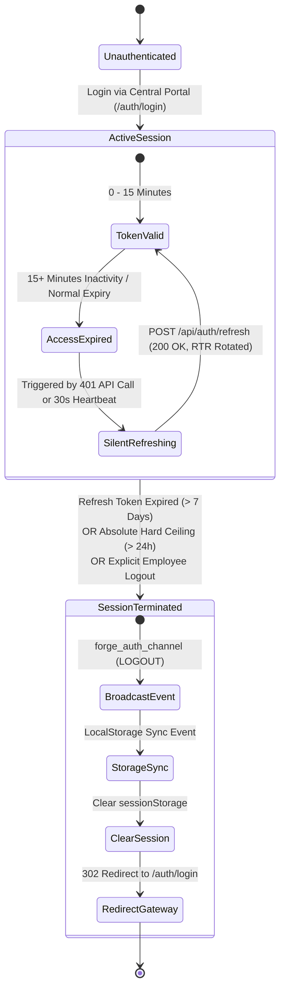
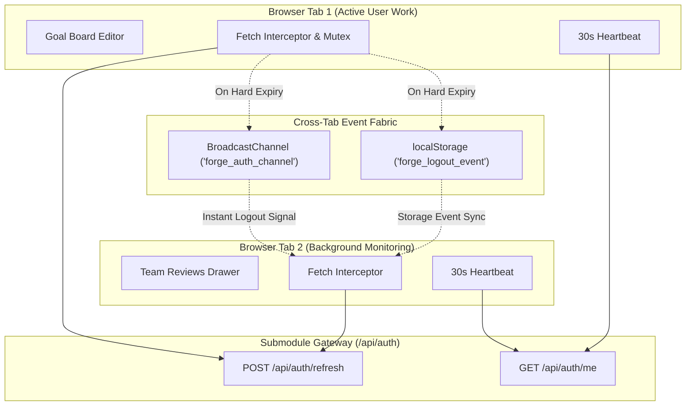

# Session Lifecycle, Sliding Renewal & Silent Auto-Refresh Architecture

> **Standard**: SG Forge Zero-Trust Authentication Architecture (2026 LTS)  
> **Traceability**: `[HLR-SDK-301]`, `[LLR-AUTH-006]`, `[HLR-AUTH-101]`  
> **Status**: Living Architectural Specification (LTS)

---

## 1. Architectural Overview & Design Philosophy

The **Individual Goal Center (`@forge-apps/goals`)** operates under strict enterprise Zero-Trust invariants while providing a zero-disruption developer and employee experience.

Authentication in the SG Forge platform utilizes a **dual-tier token topology**:
1. **Access Token (`forge_session`)**: A short-lived, cryptographically signed JSON Web Token (`Ed25519` / `HMAC-SHA256`) with a 15-minute default validity window. It carries the employee's verified claims (identity, department, leadership roles) and is verified statelessly by micro-apps via the internal SDK (`verifySessionToken`).
2. **Refresh Token (`forge_refresh_token`)**: A high-entropy, cryptographically hashed token persisted in the Central Auth session store with a 7-day sliding inactivity limit and hard absolute session ceiling.

When an employee's access token expires mid-workflow, the Goal Center SPA runtime executes **Silent Auto-Renewal**: transparently negotiating a fresh session without interrupting the user, flashing loading overlays, or bouncing to `/auth/login`.

---

## 2. Interactive Sequence: Silent Refresh & Request Replay

When one or more API requests return `401 Unauthorized` with `code: "TOKEN_EXPIRED"`:
1. The **Proactive Fetch Interceptor** traps the 401 response before it reaches the view layer.
2. The **Single-Flight Concurrency Lock** ensures that only *one* refresh network request is sent, preventing Refresh Token Rotation (RTR) replay race conditions.
3. Upon receiving renewed session cookies, all enqueued in-flight requests are replayed transparently.

---

## 3. Session State Machine & Lifecycle Transitions

---

## 4. Multi-Tab Real-Time Synchronization

To prevent state desynchronization across multiple open browser tabs:
- **BroadcastChannel (`forge_auth_channel`)**: Instantly notifies sibling tabs when a session is terminated or explicitly logged out.
- **LocalStorage Sync Listener (`forge_logout_event`)**: Serves as a fallback for browsers or sandboxes where `BroadcastChannel` is restricted.
- **Shared Inactivity Heartbeat**: Active tabs query `/api/auth/me` every 30 seconds (throttled when the tab is in the background via `document.visibilityState === 'visible'`).

---

## 5. Security Invariants & Defense-in-Depth

1. **OWASP ASVS 5.0 Compliance**: Refresh Token Rotation (RTR) ensures that every refresh token is single-use. Replay of an invalidated refresh token triggers family revocation.
2. **Strict Cookie Hygiene**:
   - `forge_session`: `HttpOnly; SameSite=Lax; Path=/; Max-Age=900` (`Secure` in production).
   - `forge_refresh_token`: `HttpOnly; SameSite=Strict; Path=/; Max-Age=604800` (`Secure` in production).
3. **No Infinite Recursion**: The client interceptor explicitly excludes `/api/auth/refresh`, `/api/auth/login`, and `/api/auth/logout` from triggering nested refresh attempts.
4. **Autonomous Submodule Guard**: If Central Auth is offline or executing in an isolated CI container, the Goal Center server maintains deterministic local signing and verification, preventing cascading microservice failures.
