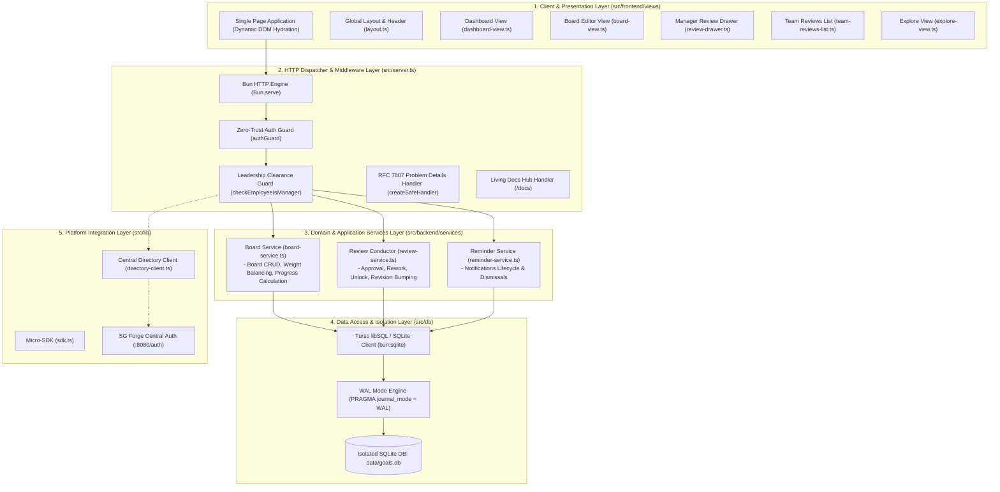

# Individual Goal Center System Architecture

> **Document Type**: System Architecture Specification | **Standard**: SG Forge Clean Architecture (2026 LTS) | **Traceability**: `[HLR-GOALS-001]`, `[HLR-SDK-301]`

---

## 1. Architectural Philosophy & Clean Architecture Layers

The **Individual Goal Center (`@forge-apps/goals`)** is architectured according to Clean Architecture and Domain-Driven Design principles, structured into strict, decoupled horizontal layers:

---

## 2. Invariants & Autonomous Isolation Rules

1. **Autonomous Submodule Invariant**: The repository is 100% self-contained. It builds, tests, executes, and containerizes with zero reliance on the central platform monorepo.
2. **Dedicated Database Isolation**: All persistence operations execute against `./data/goals.db`. The application never connects to or queries other micro-app databases.
3. **Zero Monorepo Bleed**: Source code contains zero relative path traversal imports escaping the repository root (`../../..`).
4. **Zero-Trust Security Boundary**: Every incoming request must carry a verifiable cryptographic signature (Ed25519 or HMAC) validated via `authGuard`.
5. **Universal Zero-Browser-Defaults**: Native browser `alert()`, `confirm()`, `prompt()`, and native OS `<select>` elements are strictly forbidden. The UI strictly uses Astryx glassmorphic components and themed selectors.

---

## 3. Component Breakdown

### 1. HTTP Server & Dispatcher (`src/server.ts`)
- Serves HTTP requests via `Bun.serve`.
- Wraps all route handlers in `createSafeHandler` to guarantee RFC 7807 problem responses on any client or server exception.
- Provides `/health` dual-probe endpoint (`livez`, `readyz`, memory usage, uptime).
- Routes `/docs` and `/docs/api` to `handleDocsRoute` for in-app living documentation.

### 2. Domain Services (`src/backend/services/`)
- **`board-service.ts`**: Handles creation, updating, progress tracking, and retrieval of goal boards and milestone items. Enforces the 100% weight balance invariant.
- **`review-service.ts`**: Orchestrates state transitions (`SUBMITTED`, `APPROVED`, `REWORK_REQUESTED`, `UNLOCK_REQUESTED`), audit comment recording, revision increments, and manager electronic signatures.
- **`reminder-service.ts`**: Manages operational reminders and notifications dispatched upon review events.

### 3. Data Storage (`src/db/`)
- Initializes and manages isolated SQLite database `data/goals.db`.
- Enforces SQLite concurrency pragmas:
  - `PRAGMA journal_mode = WAL;` (Write-Ahead Logging for concurrent readers/writers).
  - `PRAGMA busy_timeout = 5000;` (Automatic retry on lock contention up to 5 seconds).
  - `PRAGMA foreign_keys = ON;` (Referential integrity enforcement).
- Maintains relational schemas: `users`, `projects`, `goal_boards`, `goal_items`, `review_comments`, and `reminders`.

### 4. Integration & Directory Client (`src/lib/`)
- **`sdk.ts`**: Standalone micro-SDK providing structured logging, RFC 7807 safe handler, database client, and session signature verification.
- **`directory-client.ts`**: Inter-service client communicating with SG Forge Central Auth (`:8080/auth`) to query employee rosters, management hierarchies, and managerial status.
- **`ui.ts` & `icons.ts`**: Design system foundations, pure vector SVG definitions, and Astryx styling helpers.
