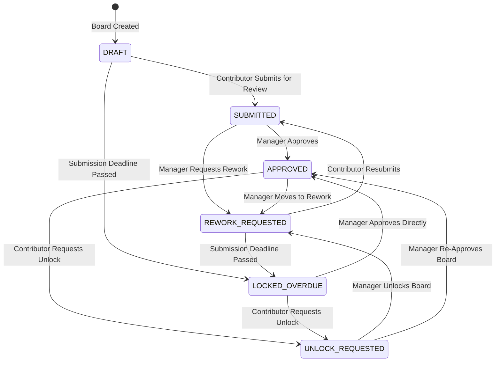

# High-Level Requirements (HLR): Goal Board Review & Access Lifecycle

## Requirement Overview
- **Requirement ID**: `[HLR-GOALS-001]`
- **Title**: Multi-Role Goal Board Review Lifecycle, Submission Timelines, and Scoped Visibility Matrix
- **Target Audience**: Goal Board Owners (Contributors), Direct Managers (Reviewers), and Platform Admins

---

## 1. Role-Scoped Visibility Matrix

| View Perspective | Owner (Contributor) | Manager (Reviewer) | 3rd-Party Viewer |
| :--- | :--- | :--- | :--- |
| **Milestone Content** | Full Editable / Read-Only | Read-Only | Read-Only (Current Version) |
| **Review Timeline Button** | ✅ Visible | ✅ Visible | ❌ Hidden |
| **Status Badge** | ✅ Visible | ✅ Visible | ❌ Hidden |
| **Lock Banner** | ✅ Visible | ✅ Visible | ❌ Hidden |
| **Review Audit Notes** | ✅ Visible | ✅ Visible | ❌ Hidden |
| **Action Controls** | Submit, Request Unlock | Approve, Rework, Unlock, Deadline | None (Read-Only) |

---

## 2. Review State Machine Diagram

---

## 3. Key Operational Rules
1. **Air-Gapped Privacy**: 3rd-party team members viewing a board outside their management chain strictly see committed milestone snapshots with zero review status badges or internal audit stream history.
2. **Manager Superior Overrides**: Managers can move an `APPROVED` board back to `REWORK_REQUESTED` or directly issue an `UNLOCK` at any time.
3. **Deadline Enforcer**: If a `submissionDeadline` is specified and expires without submission, the system automatically transitions the board status to `LOCKED_OVERDUE`.
