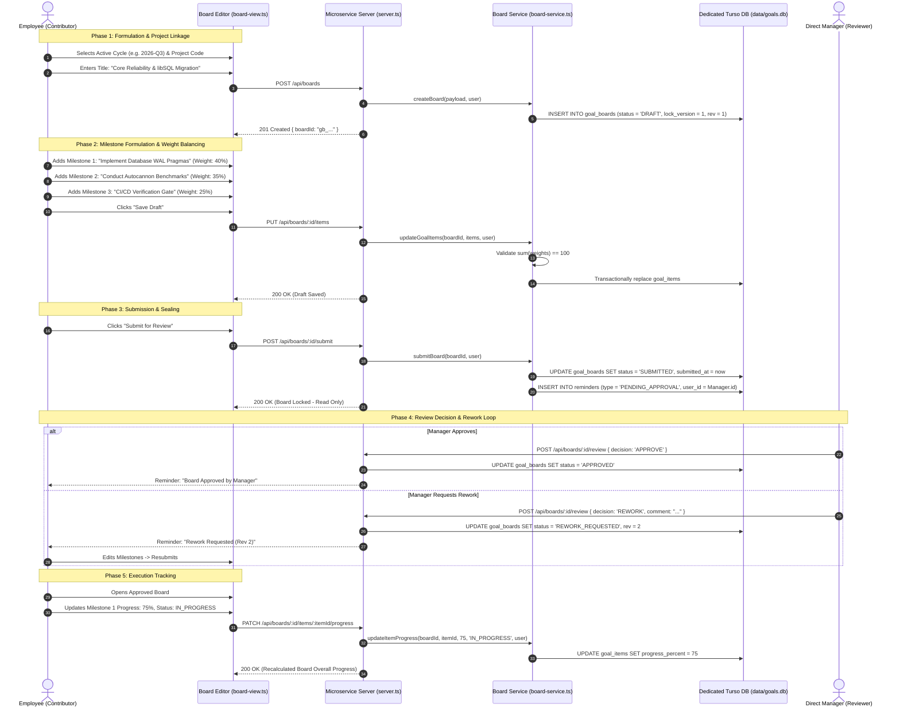

# Contributor & Goal Owner Journey Specification

> **Document Type**: User Journey Architecture | **Target Actor**: Individual Contributor / Goal Owner | **Traceability**: `[HLR-GOALS-002]`, `[LLR-GOALS-003]`

---

## 1. Journey Overview & Business Value

The Contributor Journey represents the core workflow of an individual employee formulating, validating, committing, and tracking quarterly or annual performance objectives. In contrast to ambiguous goal-setting spreadsheets, the Goal Center enforces:
- Explicit linkage to organizational project codes.
- Strict mathematical milestone weight balancing (weights must sum to 100%).
- State-machine driven review submission and locking to prevent silent mid-cycle goal alterations.
- An execution phase enabling granular progress tracking against agreed-upon deliverables.

---

## 2. End-to-End Sequence Flow

---

## 3. Step-by-Step Functional Journey

### Step 1: Authentication & Clearance Hydration
1. Contributor navigates to the application root `/`.
2. `authGuard` verifies session cookie (`forge_session`) or Bearer token using asymmetric Ed25519 or symmetric HMAC signatures.
3. If valid, `syncEmployeeProfile` executes:
   - Queries Central Directory (`fetchEmployeesList`, `fetchEmployeeHierarchy`).
   - Caches manager details (`managerId`, `managerName`, `managerEmail`), job title, and department.
   - Hydrates local `users` table in `data/goals.db`.

### Step 2: Goal Formulation & Mathematical Weight Validation
1. From the Dashboard, the contributor clicks **Create Goal Board**.
2. Selects an organizational project from `GET /api/projects`. If no project matches, a new project can be registered via `POST /api/projects`.
3. Defines milestones with:
   - Title & Detailed Description.
    - Category (`DELIVERABLE`, `METRIC`, `LEARNING`).
   - Target Delivery Date (`YYYY-MM-DD`).
   - Weight percentage (integer between 1 and 100).
4. Validation Rule: Total weights across all items must equal **exactly 100%**. If $\sum w_i \neq 100$, submission is blocked client-side and rejected with HTTP 400 server-side.

### Step 3: Review Submission & Immutability Lock
1. Once weights sum to 100%, the contributor submits via `POST /api/boards/:id/submit`.
2. The server asserts `assertBoardMutable`:
   - Throws `BoardLockedError` (HTTP 423) if already submitted or locked.
   - Transitions `status` to `SUBMITTED`.
   - Records timestamp `submitted_at`.
   - Dispatches a `PENDING_APPROVAL` reminder targeted to the contributor's manager.
3. The board UI immediately switches to locked read-only state.

### Step 4: Responding to Manager Feedback & Rework
1. If the manager requests revisions, the board transitions to `REWORK_REQUESTED` and increments `revision_number`.
2. A `REWORK_REQUIRED` reminder appears in the contributor's notification tray.
3. The contributor opens the board, views line-item comments left by the manager, makes requested adjustments, and resubmits.

### Step 5: Execution Progress & Milestone Unlock
1. Once `APPROVED`, the contributor executes against deliverables.
2. Contributor updates progress percentages directly on each milestone via `PATCH /api/boards/:id/items/:itemId/progress`.
3. If organizational priorities shift mid-cycle, the contributor clicks **Request Unlock**, supplying an audit reason via `POST /api/boards/:id/review` with decision `REQUEST_UNLOCK`.

---

## 4. Error Handling & Edge Cases

| Scenario | HTTP Status | RFC 7807 Error Code | System Action |
| :--- | :--- | :--- | :--- |
| Sum of weights != 100% | 400 Bad Request | `INVALID_WEIGHT_SUM` | Returns validation failure; highlights offending fields |
| Edit attempted on submitted board | 423 Locked | `BOARD_LOCKED` | Rejects mutation; enforces manager rework/unlock flow |
| Deadline passed prior to submission | 423 Locked | `BOARD_LOCKED_OVERDUE` | Transitions status to `LOCKED_OVERDUE`; prompts unlock petition |
| Unauthorized non-owner mutation | 403 Forbidden | `FORBIDDEN_NOT_OWNER` | Blocks update; logs audit security alert |
