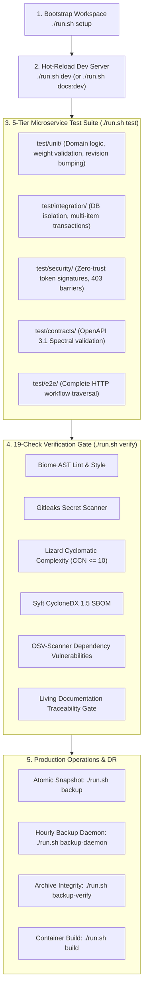

# Developer & Operator Journey Specification

> **Document Type**: Operational Architecture Specification | **Target Actor**: Software Engineer / DevOps Engineer / Site Reliability Engineer | **Traceability**: `[HLR-GOALS-001]`, `[HLR-SDK-301]`, `[LLR-GOALS-001]`, `[LLR-GOALS-002]`

---

## 1. Journey Overview & Autonomous Standards

The Developer & Operator Journey details the local engineering workflow, testing rigor, automated verification gates, database operations, and container lifecycle. As an autonomous SG Forge submodule, the repository:
- Relies on zero host runtime dependencies (portable Bun runtime located in `./portables/bun`).
- Provides a modular script runner orchestrating all commands via `./run.sh <command>`.
- Enforces a 19-check pre-commit verification gate (`./run.sh verify`).
- Implements disaster recovery through atomic SQLite backups (`VACUUM INTO`).

---

## 2. End-to-End Operational Lifecycle



---

## 3. Step-by-Step Developer Workflows

### 1. Workspace Bootstrapping
```bash
./run.sh setup
```
- Activates the portable Bun runtime in `./portables/bun/bin/bun`.
- Initializes file permissions across `./portables/bin/*` and shell scripts.
- Creates required runtime directories: `data/`, `logs/`, `backups/`.
- Provisions the isolated SQLite database `data/goals.db` with WAL pragmas.

### 2. Development Execution
```bash
# Start hot-reload server at :8090
./run.sh dev

# Or start server with Living Documentation Engine
./run.sh docs:dev
```
- Access application UI: `http://localhost:8090`
- Access Astryx Living Documentation Hub: `http://localhost:8090/docs`
- Access OpenAPI 3.1 interactive explorer: `http://localhost:8090/docs/api`
- Health check probe: `http://localhost:8090/health`

### 3. 5-Tier Testing Suite
```bash
# Run all test suites
./run.sh test

# Run specific tier
bun test test/unit
bun test test/integration
bun test test/security
bun test test/contracts
bun test test/e2e
```

### 4. Running the 19-Check Pre-Commit Gate
```bash
./run.sh verify
```
Validates the 19 mandatory enterprise checks before committing:
1. Ignore files, `.gitattributes`, and LF line endings.
2. 500-Line soft file cap on all source files.
3. Zero hardcoded secrets, passwords, or private keys.
4. Strict TypeScript compilation (`tsc --noEmit`).
5. Dead code and unused export AST audit.
6. Standalone Dockerfile and compose standards with `HEALTHCHECK`.
7. Clean imports with zero relative traversal escapes (`../../..`).
8. Zero central monorepo imports (`@forge/*` or `apps/src/*`).
9. Structured JSON logging with RFC 7807 error handling.
10. Multi-agent directives synchronization (`AGENTS.md`, `GEMINI.md`, etc.).
11. Dedicated `logs/` directory and log rotation.
12. 100% passing test suites across all 5 tiers.
13. Astryx UI compliance (zero browser popups, zero emojis).
14. Dedicated Turso DB isolation in `data/goals.db`.
15. Autonomous egress security and air-gap invariants.
16. Multi-OS CLI runner integrity (`run.sh`, `run.bat`).
17. Permissive OSI license compliance (Apache-2.0).
18. Cyclomatic complexity cap (Lizard CCN <= 10).
19. Living documentation and traceability gate (HLRs, LLRs, OpenAPI 3.1, `@requirements`).

---

## 4. Disaster Recovery & Database Maintenance

### Atomic Database Snapshots
```bash
# Generate immediate consistent snapshot
./run.sh backup
```
Executes SQLite's native `VACUUM INTO` command, generating a non-blocking snapshot in `backups/backup-goals-<timestamp>.db`.

### Hourly Backup Daemon
```bash
# Run background backup process
./run.sh backup-daemon
```
Runs a background loop snapshotting the database every 3600 seconds, maintaining rolling disaster recovery archives.

### Integrity Verification
```bash
# Verify integrity of latest backup archive
./run.sh backup-verify
```
Runs `PRAGMA integrity_check;` on the most recent backup archive to certify zero byte corruption.

---

## 5. Containerization & Deployment

### Standalone Docker Build
```bash
# Build standalone production image
./run.sh build
```
Builds a self-contained Alpine-based container image with `context: .`, embedding the portable runtime, static assets, and health probe.

### Dev & Prod Compose Stacks
```bash
# Launch development stack with live volume reload
./run.sh docker dev up

# Launch production stack
./run.sh docker prod up
```
