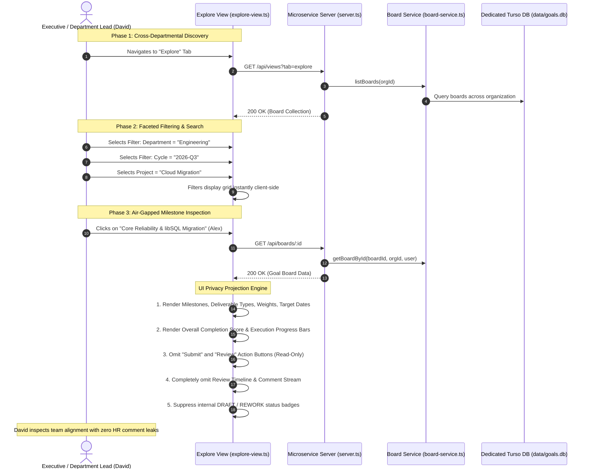

# Leadership & Cross-Functional Observer Journey Specification

> **Document Type**: User Journey Architecture | **Target Actor**: Executive Leadership / Department Leads / Cross-Functional Observers | **Traceability**: `[HLR-GOALS-002]`

---

## 1. Journey Overview & Privacy Architecture

The Leadership & Cross-Functional Observer Journey addresses the organizational requirement for strategic transparency without compromising managerial privacy. In an enterprise setting:
- Executive leadership and peer leads need visibility into cross-departmental milestone commitments and alignment.
- **Privacy Air-Gap**: Peer observers must NEVER see private manager evaluation notes, rejection rationale, rework discussions, or draft status churn.
- **Sanitized Projection**: The Explore view dynamically strips sensitive audit history, delivering a clean projection of committed deliverables and current progress percentages.

---

## 2. End-to-End Sequence Flow

---

## 3. Step-by-Step Functional Journey

### Step 1: Navigating to the Organization Explore Portal
1. An authorized leader or observer clicks the **Explore** tab in the main sidebar.
2. The Explore View fetches all organizational boards registered within the tenant (`orgId`).
3. High-level metric banners summarize total organizational commitments, active projects, and aggregate completion percentages across teams.

### Step 2: Faceted Discovery & Project Alignment
1. The observer filters boards by:
   - **Department**: Filter by Engineering, Product, Design, Operations, etc.
   - **Performance Cycle**: Compare commitments between Q1, Q2, Q3, and annual cycles.
   - **Project Association**: View all contributor boards aligned with strategic projects like "Cloud Migration" or "Security Hardening".
2. Search input provides real-time client-side substring matching across board titles and contributor display names.

### Step 3: Privacy Air-Gap & Sanitized Projection
When an observer views a board outside their direct management chain, the application enforces a strict privacy projection:
1. **Milestones & Deliverables**: Full visibility into milestone titles, categories, weights, target dates, and progress percentages.
2. **Review Comments Redaction**: The `review_comments` table records are NEVER displayed in the 3rd-party view.
3. **Action Button Suppression**: Buttons for `Submit`, `Request Rework`, `Approve`, `Request Unlock`, or `Unlock` are completely hidden.
4. **Draft Status Cloaking**: Internal workflow churn (e.g. revisions in `REWORK_REQUESTED`) is presented as clean, in-flight work without disclosing administrative rejection counts.

---

## 4. Role-Scoped Visibility Matrix

| Data Element | Goal Board Owner (Contributor) | Direct Manager (Reviewer) | 3rd-Party Observer / Leadership |
| :--- | :--- | :--- | :--- |
| **Milestone Deliverables & Weights** | Full Editable / Read-Only | Full Read-Only | Full Read-Only |
| **Execution Progress Bars** | Editable (Post-Approval) | Read-Only | Read-Only |
| **Status Badge (`APPROVED`, etc.)** | Visible | Visible | Hidden / Neutral Indicator |
| **Review Timeline & Comments** | Visible | Visible | **Completely Redacted** |
| **Action Controls (Approve/Rework)** | Hidden | **Visible** | **Hidden** |
| **Submission Deadline Badge** | Visible | Visible | Hidden |

---

## 5. Security & Boundary Enforcement

- **Clearance Boundary**: If an unauthenticated or non-manager user attempts to access the microservice without verified clearance, the server blocks ingress at the HTTP boundary:
  - API requests: Returns HTTP 403 Problem Detail (`FORBIDDEN_MANAGER_ONLY`).
  - Web browser requests: Renders `renderLeadershipRestrictedView`, informing the user that leadership or managerial status is required to access the Individual Goal Center.
