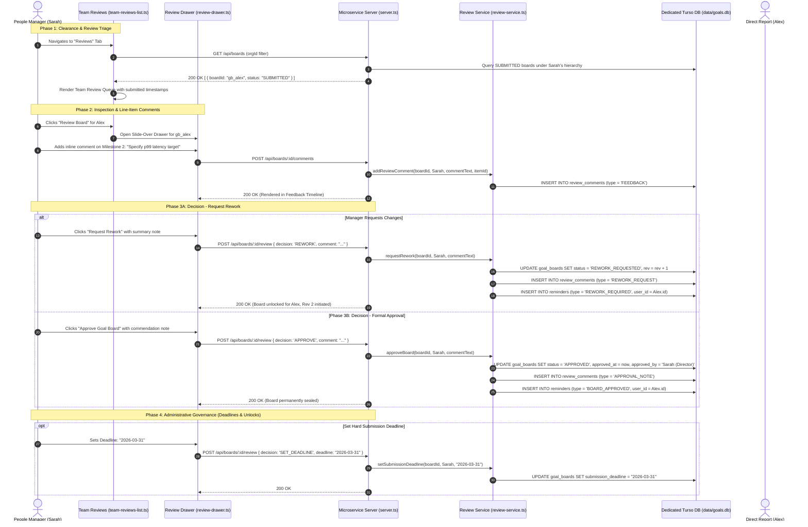

# People Manager & Reviewer Journey Specification

> **Document Type**: User Journey Architecture | **Target Actor**: People Manager / Department Lead / Reviewer | **Traceability**: `[HLR-GOALS-002]`, `[LLR-GOALS-004]`

---

## 1. Journey Overview & Review Governance

The Manager Review Journey governs the inspection, feedback cycle, formal sign-off, and administrative management of goal boards submitted by reporting employees. Key governance rules include:
- **Segregation of Duties**: A manager cannot approve or rework their own goal board (`assertManagerOrAdmin`).
- **Clearance Verification**: Access to the manager workspace requires verified managerial clearance either via Central Directory (`isManager` API), direct leadership roles (`roles/manager`, `roles/admin`), or local subordinate reporting lines.
- **Granular Line-Item Feedback**: Managers can comment on specific deliverables or the overall board to guide rework iterations.
- **Audit Signature Sealing**: Approvals affix the reviewer's display name, role/title, and timestamp, permanently sealing the revision record.

---

## 2. End-to-End Sequence Flow

---

## 3. Step-by-Step Functional Journey

### Step 1: Managerial Clearance Verification
1. When a user accesses `/` with `tab=reviews`, `server.ts` invokes the Manager Clearance Guard:
   - Check 1: Does `auth.user.roles` contain `roles/manager`, `roles/admin`, or `roles/super_admin`?
   - Check 2: If false, query Central Directory: `GET /api/v1/auth/hierarchy/:id/is-manager`.
   - Check 3: If Central Directory is unreachable, query local SQLite: `isLocalManager(userId)`.
2. If verified, the user is authorized. If unverified, the server returns HTTP 403 with `FORBIDDEN_MANAGER_ONLY` and renders the Astryx Leadership Restricted View.

### Step 2: Team Reviews Dashboard
1. The **Reviews** tab displays all boards currently in `SUBMITTED`, `REWORK_REQUESTED`, and `UNLOCK_REQUESTED` statuses within the manager's reporting scope.
2. The UI calculates days elapsed since submission to highlight urgent reviews.
3. Search and filtering controls allow narrowing by cycle, employee name, or department.

### Step 3: Interactive Review Drawer & Audit Comments
1. Clicking **Review Board** opens the glassmorphic `ReviewDrawer` component without navigating away from the page.
2. The drawer presents:
   - Contributor header: Name, department, job title, and submission revision number.
   - Milestone cards: Title, category, weight, and delivery target.
   - Interactive feedback thread: Enables entering review comments tagged directly to an individual milestone or to the overall board.
3. Every comment creates an immutable row in `review_comments` with the author's identity and timestamp.

### Step 4: Approval Sign-Off & Rework Rejections
1. **Rework Request**:
   - Requires a non-empty explanation comment.
   - Sets status to `REWORK_REQUESTED`.
   - Increments `revision_number` ($R_{k+1} = R_k + 1$) and `lock_version`.
   - Generates a `REWORK_REQUIRED` reminder for the contributor.
   - Automatically dismisses previous `PENDING_APPROVAL` reminders.
2. **Approval Sign-Off**:
   - Sets status to `APPROVED`.
   - Records `approved_at` timestamp and `approved_by` electronic signature (e.g. `"Sarah Smith (Engineering Director)"`).
   - Generates a `BOARD_APPROVED` notification for the contributor.

### Step 5: Setting Deadlines & Unlocking Approved Boards
1. **Submission Deadlines**: Managers can define a cutoff date (`submission_deadline`). If a contributor fails to submit by this date, the system auto-locks the board in `LOCKED_OVERDUE`.
2. **Emergency Unlock**: If an approved board requires milestone adjustments due to organizational restructuring, the manager can issue an explicit `UNLOCK` decision, returning the board to `REWORK_REQUESTED` for revisions.

---

## 4. Error Handling & Security Invariants

| Scenario | HTTP Status | RFC 7807 Error Code | System Action |
| :--- | :--- | :--- | :--- |
| Manager attempts to review own board | 403 Forbidden | `FORBIDDEN_SELF_REVIEW` | Segregation of duties violation; rejects operation |
| Non-manager attempts review endpoint | 403 Forbidden | `FORBIDDEN_MANAGER_ONLY` | Denies execution; returns problem detail |
| Review decision without explanation on rework | 400 Bad Request | `MISSING_REWORK_COMMENT` | Validation failure; prompts for feedback text |
| Approval attempted on non-submitted board | 400 Bad Request | `INVALID_STATUS_TRANSITION` | Rejects transition; enforces state machine rules |
