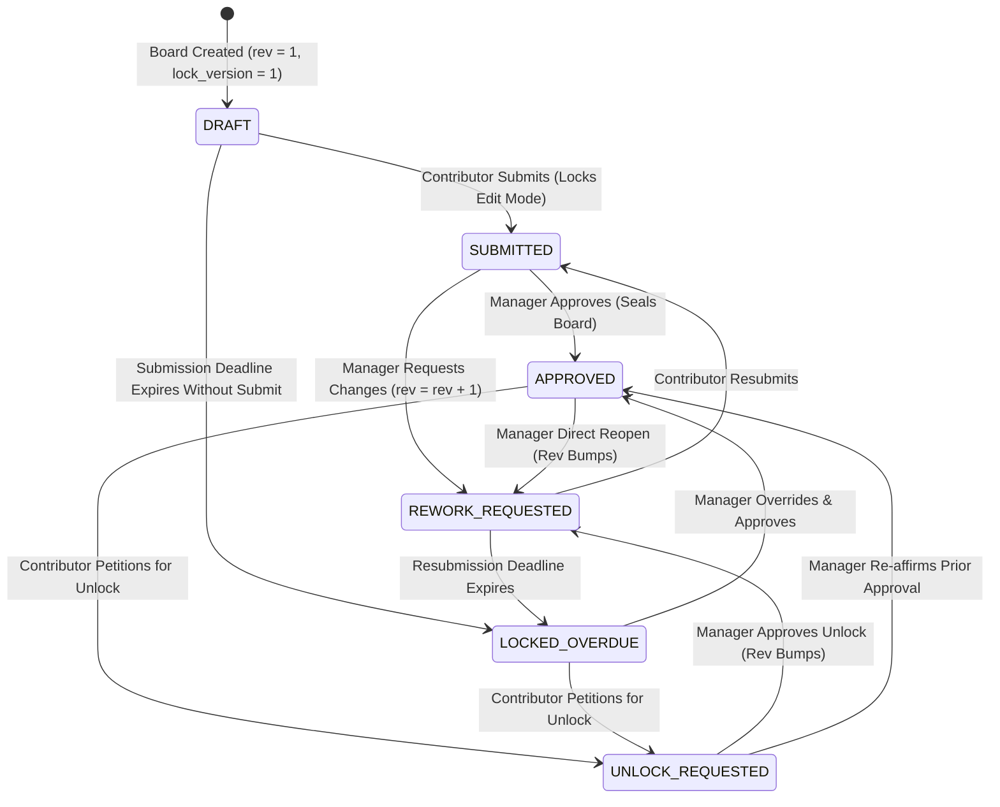
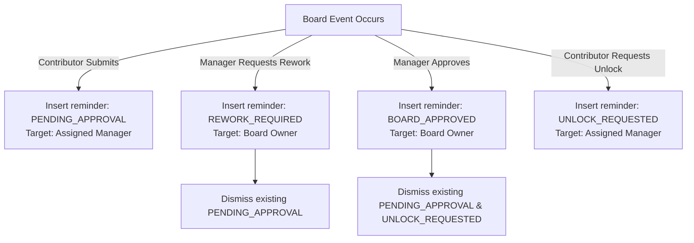

# System Lifecycle & Background Automation Journey Specification

> **Document Type**: System Architecture Specification | **Target Actor**: Automated System / Cron / Concurrency Engine | **Traceability**: `[HLR-GOALS-001]`, `[HLR-GOALS-002]`, `[LLR-GOALS-004]`, `[LLR-GOALS-006]`

---

## 1. Lifecycle Overview & Automation Invariants

The System Lifecycle Journey orchestrates non-human background operations, state machine transitions, concurrency control, automated deadline enforcement, notification dispatch, and identity cache synchronization. It guarantees:
- **Zero Inconsistent States**: All status mutations, revision increments, and reminder creations execute inside atomic SQLite transactions.
- **Optimistic Concurrency Control**: Board edits check and increment `lock_version` to prevent conflicting simultaneous mutations.
- **Automated Deadline Sealing**: If a submission deadline passes without submission, the system transitions the board to `LOCKED_OVERDUE`.
- **Fault-Tolerant Profile Caching**: In-memory 5-minute TTL caching backed by local SQLite persistence prevents platform downtime during Central Directory network partitions.

---

## 2. Finite State Machine Lifecycle Diagram

---

## 3. Core Automated Subsystems

### 1. Submission Deadline Enforcer
When a board is created or updated, a manager may specify `submission_deadline` (`YYYY-MM-DD`).
- **Evaluation Mechanism**: Upon every read request (`getBoardById`, `listBoards`), the system compares the current system timestamp against the deadline.
- **Auto-Transition**: If $\text{current\_time} > \text{deadline}$ AND `status` $\in \{\text{'DRAFT'}, \text{'REWORK\_REQUESTED'}\}$, the status is automatically transitioned to `LOCKED_OVERDUE`.
- **Lock Enforcement**: When `LOCKED_OVERDUE`, all milestone edits via `PUT /api/boards/:id/items` are rejected with `BoardLockedError` (HTTP 423). The contributor must use the `REQUEST_UNLOCK` flow.

### 2. Revision & Concurrency Versioning
To maintain an immutable audit trail and prevent lost updates:
- **`revision_number`**: Incremented whenever a board undergoes rework ($R_{k+1} = R_k + 1$). Tracks the formal cycle iteration.
- **`lock_version`**: Incremented on every transactional update ($\text{LV}_{k+1} = \text{LV}_k + 1$). Used for optimistic concurrency detection.
- **Atomic Transactions**: Executed via `goalsDb.transaction(() => { ... })` guaranteeing that board updates, audit comment insertions, and reminder creations either succeed together or roll back completely.

### 3. Notification & Reminder Lifecycle
The notification engine generates contextual alerts stored in the `reminders` table:

Reminders are dismissed either automatically upon state transitions or manually by the user via `POST /api/reminders/:id/dismiss`.

### 4. Central Directory Cache & Partition Tolerance
To ensure high availability even if the Central Auth service (`:8080/auth`) is temporarily unreachable:
1. **In-Memory Cache**: `profileCache` stores resolved user profiles keyed by `userId` with a 5-minute TTL (`PROFILE_TTL_MS = 300,000`).
2. **Local SQLite Persistence**: Every successfully synchronized profile is persisted into the local `users` table via `upsertUser`.
3. **Graceful Fallback**: If the central HTTP request times out (3000ms abort signal) or fails, the application automatically serves the cached record from local SQLite.

---

## 4. State Transition Matrix

| Current Status | Event / Trigger | Actor | Target Status | Side Effects |
| :--- | :--- | :--- | :--- | :--- |
| `DRAFT` | Submit | Contributor | `SUBMITTED` | Locks edits; inserts `PENDING_APPROVAL` reminder |
| `DRAFT` | Deadline passes | System | `LOCKED_OVERDUE` | Locks edits; flags overdue banner |
| `SUBMITTED` | Approve | Manager | `APPROVED` | Seals board; stamps `approved_at`, `approved_by` |
| `SUBMITTED` | Request Rework | Manager | `REWORK_REQUESTED` | `rev++`; unlocks edits; inserts `REWORK_REQUIRED` reminder |
| `REWORK_REQUESTED` | Resubmit | Contributor | `SUBMITTED` | Locks edits; inserts `PENDING_APPROVAL` reminder |
| `APPROVED` | Request Unlock | Contributor | `UNLOCK_REQUESTED` | Inserts `UNLOCK_REQUESTED` reminder for manager |
| `UNLOCK_REQUESTED` | Grant Unlock | Manager | `REWORK_REQUESTED` | `rev++`; unlocks milestone editing |
| `LOCKED_OVERDUE` | Request Unlock | Contributor | `UNLOCK_REQUESTED` | Inserts unlock petition reminder |
