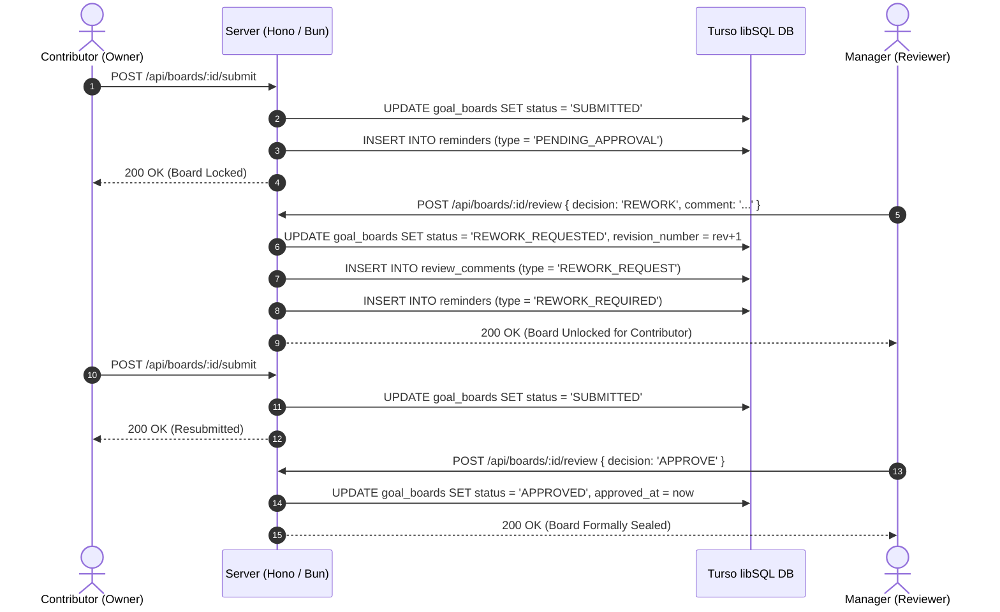

# Low-Level Requirements (LLR): Review Conductor API Contracts & State Transitions

## Requirement Overview
- **Requirement ID**: `[LLR-GOALS-001]`, `[LLR-GOALS-002]`
- **Module**: `src/backend/services/review-service.ts`, `src/backend/services/board-service.ts`

---

## 1. Sequence Diagram: Review Approval & Rework Flow



---

## 2. API Endpoint Payload Specifications

### `POST /api/boards/:id/review`
Processes manager decisions and contributor unlock requests.

**Request Payload**:
```json
{
  "decision": "APPROVE | REWORK | REQUEST_UNLOCK | UNLOCK | SET_DEADLINE",
  "comment": "Optional feedback text or unlock justification",
  "deadline": "YYYY-MM-DD"
}
```

**Response Payload (`GoalBoard`)**:
```json
{
  "id": "board_123",
  "status": "APPROVED | REWORK_REQUESTED | UNLOCK_REQUESTED | LOCKED_OVERDUE",
  "revisionNumber": 2,
  "submissionDeadline": "2026-03-31",
  "lockVersion": 3
}
```

---

## 3. Server-Side Guard Assertions (`assertBoardMutable`)
- Throws `BoardLockedError` (HTTP 423) if editing is attempted on `SUBMITTED`, `APPROVED`, or `LOCKED_OVERDUE` boards.
- Throws `ForbiddenError` (HTTP 403) if non-owner attempts milestone modification.
